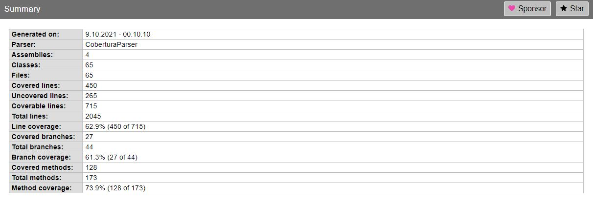

# GameStore with Tests
### Unit and integration tests added.

Patika-Hepsiburada Backend Bootcamp Homework 3.

Simple online video game store project that you can perform CRUD operations on Game, Developer and Category entities.

Following Clean Architecture principles, CQRS and Mediator pattern.
Highly inspired by Jason Taylor's Clean Architecture template and made more loosely-coupled by using Repositories in Command/Query Handlers instead of directly using EFCore DbContext.

DockerHub: https://hub.docker.com/r/frknn/gamestore
